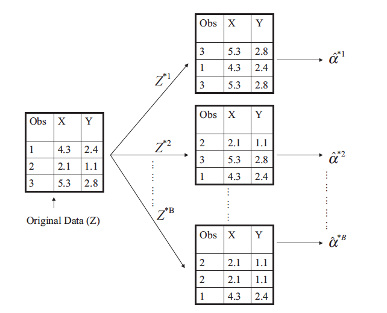
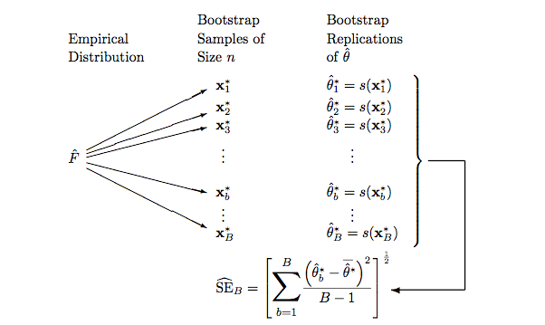

Suppose that we wish to invest a fixed sum of money in two financial
assets that yield returns of $X$ and $Y$ , respectively, where $X$ and $Y$ are
random quantities. We will invest a fraction α of our money in $X$, and will
invest the remaining $1 − \alpha$ in $Y$ . Since there is variability associated with
the returns on these two assets, we wish to choose $\alpha$ to minimize the total
risk, or variance, of our investment. In other words, we want to minimize
$\text{Var}(\alpha X +(1 −\alpha)Y)$. One can show that the value that minimizes the risk
is given by $$\alpha = \frac{\sigma_Y^2 - \sigma_{XY}}{\sigma_X^2 + \sigma_Y^2 - 2\sigma_{XY}},$$

where $\sigma_X^2 = \text{Var}(X)$, $\sigma_Y^2 = \text{Var}(Y)$, and $\sigma_{XY}=\text{Cov}(X,Y)$.

In reality, the quantities $\sigma_X^2, \sigma_Y^2$, and $\sigma_{XY}$ are unknown.  We can compute estimates for these quantities $\hat{\sigma}_X^2, \hat{\sigma}_Y^2$, and $\hat{\sigma}_{XY}$, using a data set that contains past measurements for $X$ and $Y$.  We can then estimate the value of $\alpha$ that minimizes the variance of our investment using

$$\hat{\alpha} = \frac{\hat{\sigma}_Y^2 - \hat{\sigma}_{XY}}{\hat{\sigma}_X^2 + \hat{\sigma}_Y^2 - 2\hat{\sigma}_{XY}}.$$

We can use this approach for estimating $\alpha$ on a simulated data set.  For the following simulation, we genereate simulate 100 pairs of returns for the investments $X$ and $Y$ where $\sigma_X^2 = 1, \sigma_Y^2 = 1.25$, and $\sigma_{XY} = 0.5.$ 

```{r warning = FALSE, message = FALSE}
library(mvtnorm)
sigmaX2 <- 1
sigmaY2 <- 1.25
sigmaXY <- 0.5
SIGMA <- matrix(c(sigmaX2, sigmaXY, sigmaXY, sigmaY2), nrow = 2, byrow = TRUE)
SIGMA          # Variance Covaraince Matrix
n <- 100       
set.seed(141)
Xorig <- rmvnorm(n = n, mean = c(0, 0), sigma = SIGMA, method = "chol")
head(Xorig)
colnames(Xorig) <- c("X", "Y")
head(Xorig)
apply(Xorig, 2, mean)
var(Xorig)
plot(Xorig, col = "blue", pch = 19)
DF <- data.frame(Xorig)
head(DF)
library(ggplot2)
ggplot(data = DF, aes(x = X, y = Y)) +
  geom_point(color = "darkgreen") + 
  theme_bw()
library(ggvis)
DF %>% 
  ggvis(x = ~X, y = ~Y) %>% 
  layer_points(fill := "green")
alphahat <- (var(Xorig)[2,2] - var(Xorig)[1,2]) / 
  (var(Xorig)[1,1] + var(Xorig)[2, 2] - 2*var(Xorig)[1, 2])
alphahat
```

Consider generating four simulated data sets.

```{r, fig.width = 7, fig.height = 7}
set.seed(123)
X1 <- rmvnorm(n = n, mean = c(0, 0), sigma = SIGMA, method = "chol")
X2 <- rmvnorm(n = n, mean = c(0, 0), sigma = SIGMA, method = "chol")
X3 <- rmvnorm(n = n, mean = c(0, 0), sigma = SIGMA, method = "chol")
X4 <- rmvnorm(n = n, mean = c(0, 0), sigma = SIGMA, method = "chol")
colnames(X1) <- c("X", "Y")
colnames(X2) <- c("X", "Y")
colnames(X3) <- c("X", "Y")
colnames(X4) <- c("X", "Y")
alphahat1 <- (var(X1)[2,2] - var(X1)[1,2]) / 
  (var(X1)[1,1] + var(X1)[2, 2] - 2*var(X1)[1, 2])
alphahat2 <- (var(X2)[2,2] - var(X2)[1,2]) / 
  (var(X2)[1,1] + var(X2)[2, 2] - 2*var(X2)[1, 2])
alphahat3 <- (var(X3)[2,2] - var(X3)[1,2]) / 
  (var(X3)[1,1] + var(X3)[2, 2] - 2*var(X3)[1, 2])
alphahat4 <- (var(X4)[2,2] - var(X4)[1,2]) / 
  (var(X4)[1,1] + var(X4)[2, 2] - 2*var(X4)[1, 2])
c(alphahat1, alphahat2, alphahat3, alphahat4)
par(mfrow = c(2, 2))
plot(X1, col = "blue")
plot(X2, col = "blue")
plot(X3, col = "blue")
plot(X4, col = "blue")
par(mfrow = c(1, 1))
```

The value of $\hat{\alpha}$ resulting from each simulated data set ranges from `r min(alphahat1, alphahat2, alphahat3, alphahat4)` to `r max(alphahat1, alphahat2, alphahat3, alphahat4)`.

It is natural to wish to quantify the accuracy of our estimate of $\alpha$.  To estimate the standard deviation of $\hat{\alpha}$, we repeat the process of simulating 100 paired observations of $X$ and $Y$, and estimating $\alpha$ 10,000 times.  We thereby obtained 10,000 estimates of $\alpha$, which we can call $\hat{\alpha}_1, \hat{\alpha}_2, \ldots, \hat{\alpha}_{10,000}.$

```{r}
set.seed(213)
R <- 10000
alpha <- numeric(R)
for(i in 1:R){
  X <- rmvnorm(n = n, mean= c(0, 0), sigma = SIGMA, method = "chol")
  colnames(X) <- c("X", "Y")
  alpha[i] <- (var(X)[2,2] - var(X)[1,2])/(var(X)[1,1] + var(X)[2, 2] - 2*var(X)[1, 2])
}
alphabar <- mean(alpha)
alphasd <- sd(alpha)
c(alphabar, alphasd)
alphabar <- round(alphabar, 4)
alphasd <- round(alphasd, 4)
```

The mean of all $`r R`$ estimates of $\alpha$ is `r alphabar`, very close to $\alpha = 0.6$, and the standard deviation of the estimates is `r alphasd`.  This gives us a very good idea of the accuracy of $\hat{\alpha}$: $\text{SE}(\hat{\alpha}) \approx `r alphasd`$. So roughly speaking, for a random samle from the population, we would expect $\hat{\alpha}$ to differ from $\alpha$ by approximately `r round(alphasd, 2)`, on average.

In practice, however, the procedure for estimating $\text{SE}(\hat{\alpha})$ outlined above
cannot be applied, because for real data we cannot generate new samples
from the original population. However, the bootstrap approach allows us
to use a computer to emulate the process of obtaining new sample sets, so that
so that we can estimate the variability of $\hat{\alpha}$ without generating additional
samples. Rather than repeatedly obtaining independent data sets from the
population, we instead obtain distinct data sets by repeatedly sampling
observations from the original data set.

This approach is illustrated in the Figure below on a simple data set, which
we call $Z$, that contains only $n = 3$ observations. 



We randomly select $n$
observations from the data set in order to produce a bootstrap data set,
$Z^{∗1}$. The sampling is performed with replacement, which means that the
replacement same observation can occur more than once in the bootstrap data set. In
this example, $Z^{∗1}$ contains the third observation twice, the first observation
once, and no instances of the second observation. Note that if an observation
is contained in $Z^{∗1}$, then both its $X$ and $Y$ values are included. We can use
$Z^{∗1}$ to produce a new bootstrap estimate for $\alpha$, which we call $\hat{\alpha}^{*1}$. This
procedure is repeated $B$ times for some large value of $B$, in order to produce
$B$ different bootstrap data sets, $Z^{∗1}, Z^{∗2}, \ldots, Z^{∗B}$, and $B$ corresponding $\alpha$
estimates, $\hat{\alpha}^{*1},\hat{\alpha}^{*2}, \ldots, \hat{\alpha}^{*B}$. 
We can compute the standard error of these bootstrap estimates using the formula

$$\text{SE}_B(\hat{\alpha}) = \sqrt{\frac{1}{B-1}\sum_{r = 1}^{B}\left(\hat{\alpha}^{*r} -\frac{1}{B}\sum_{r' = 1}^{B}\hat{\alpha}^{*r'} \right)^2}.$$

This serves a an estimate of the standard error of $\hat{\alpha}$ estimated from the original data set.

```{r}
set.seed(11)
B <- R
alphaBS <- numeric(B)
n <- dim(Xorig)[1]
n
for(i in 1:B){
index <- sample(n, n, replace = TRUE)
NX <- Xorig[index, ]
alphaBS[i] <- (var(NX)[2, 2] - var(NX)[1, 2]) / 
  (var(NX)[1, 1] + var(NX)[2, 2] - 2*var(NX)[1, 2])
}
mean(alphaBS)
sd(alphaBS)
```

```{r}
values <- c(alpha, alphaBS)
labels <- c(rep("Simulation", R), rep("BootStrap", B))
DF2 <- data.frame(values, labels)
ggplot(data = DF2, aes(x = labels, y = values)) + 
  geom_boxplot() + 
  theme_bw()
ggplot(data = DF2, aes(x = values)) + 
  geom_density(fill = "pink") + 
  facet_grid(labels ~.) + 
  theme_bw()
```

Note that the bootstrap density looks very similar to the simulation density of $\alpha$.  In particular the bootstrap estimate $\text{SE}(\hat{\alpha})= `r round(sd(alphaBS),4)`$ is very close to the estimate $`r round(sd(alpha),4)`$ obtained using $`r R`$ simulated data sets. 

## General Bootstrap Schematic



## Using the `boot` package

Start by writing a function to compute the desired quantity for a given data frame that takes two arguments: the data frame and an index.  In this example, we will use both the original simulated data (`Xorig`) and the `Portfolio` data frame from the `ISLR` package.

```{r}
library(ISLR)
Xorig <- data.frame(Xorig)
head(Portfolio)
alpha.fn <- function(DF, index){
  X <- DF$X[index]
  Y <- DF$Y[index]
  return((var(Y) - cov(X,Y)) / (var(X) + var(Y) - 2*cov(X, Y)))
}
```

This function outputs an estimate for $\alpha$ based on applying the chosen statistic to the observations indexed by the argument `index`.  For instance, the following command tells `R` to estimate $\alpha$ using all 100 observations.

```{r}
alpha.fn(Portfolio, 1:100)
alpha.fn(Xorig, 1:100)
```

The next command uses the `sample()` function to randomly select 100 observations from the range 1 to 100, with replacement.  This is equivalent to constructing a new bootstrap data set and recomputing $\hat{\alpha}$ based on the new data set.

```{r}
set.seed(3)
alpha.fn(Portfolio, sample(x = 1:100, size = 100, replace = TRUE))
alpha.fn(Xorig, sample(x = 1:100, size = 100, replace = TRUE))
```

We can implement a bootstrap analysis by performing this command many times, recording all of the corresponding estimates for $\alpha$, and computing the resulting standard deviation.  However, the `boot()` function (from the `boot` package) automates this apporach.  Below we produce $R = 1,000$ bootstrap estimates for $\alpha$.

```{r}
set.seed(1)
library(boot)
boot.obj1 <- boot(data = Portfolio, statistic = alpha.fn, R = 1000)
boot.obj1
plot(boot.obj1)
SEB1 <- sd(boot.obj1$t)
SEB1
BIAS1 <- mean(boot.obj1$t) - boot.obj1$t0
BIAS1
boot.obj2 <- boot(data = Xorig, statistic = alpha.fn, R = 1000)
boot.obj2
plot(boot.obj2)
SEB2 <- sd(boot.obj2$t)
SEB2
```

The final output shows that using the original data (`Portfolio`), $\hat{\alpha} = `r boot.obj1$t0`$, and that the bootstrap estimate for $\text{SE}(\hat{\alpha}) = `r SEB1`.$